# Crypto Futures AI Screener

A production-style local web platform for scanning Binance USDT perpetual futures, journaling trades, reviewing performance with AI, and evolving the strategy with safe dynamic indicator proposals.

This project was built around one goal: turn a manual crypto futures workflow into a repeatable system with three strong layers:
- deterministic market scanning
- structured trade journaling
- AI-assisted self-improvement without letting AI directly inject arbitrary code into the strategy engine

## What This Project Does
- Scans at least the first `200` Binance-tradable USDT perpetual coins matched from global market cap rankings
- Applies deterministic futures rules based on:
  - `1D` and `4H` EMA200 trend filter
  - breakout / retest logic
  - support bounce logic
  - consolidation breakout logic
  - RSI, Bollinger Band, volume, funding rate, and open interest filters
- Ranks the best opportunities and stores the top signals in Firestore
- Lets you manually mark a signal as selected and convert it into a tracked trade
- Lets you close trades manually and build a realized performance history
- Uses Gemini to review trades and suggest new indicators / filters
- Adds AI suggestions through a safe JSON DSL instead of arbitrary code execution
- Supports local development in a "deploy edilmis gibi" mode with real live market data and persistent Firebase storage

## Product Modules
### 1. Screener Dashboard
- Latest market scan summary
- Top signals with setup, trend, score, and explanation
- Candidate stack preview
- Scan notes and rejection summaries

### 2. Signal Detail
- Full signal breakdown
- Entry, stop, TP levels, risk/reward
- Technical snapshot and market metrics
- Manual action to select the trade

### 3. Trade Journal
- Open and closed trades
- Manual close flow
- Realized R multiple and PnL tracking
- Structured event history

### 4. AI Coach
- Trade review generation
- Mistake mining support
- Indicator suggestion flow
- Safe fallback behavior when Gemini output is incomplete or invalid

### 5. Indicator Lab
- Review AI-generated proposals
- Approve proposals into `SHADOW`
- Promote indicators through lifecycle states
- Duplicate proposal suppression and deduped proposal listing

### 6. Settings
- Manual sync triggers
- Local live workflow controls
- Risk / scan configuration foundations

## How It Works

```mermaid
flowchart LR
    A["CoinGecko Top Market Cap Coins"] --> B["Binance USDT Perpetual Matching"]
    B --> C["200 Coin Universe"]
    C --> D["1D + 4H Candle Fetch"]
    D --> E["Deterministic Rule Engine"]
    E --> F["Shortlist"]
    F --> G["Funding + Open Interest Enrichment"]
    G --> H["Signal Ranking"]
    H --> I["Firestore Signals + Candidates"]
    I --> J["Dashboard / Signal Detail"]
    J --> K["Trade Journal"]
    K --> L["Gemini Review + Indicator Suggestions"]
    L --> M["Indicator Lab"]
```


## Core Strategy Logic
### Trend Filter
- `1D` and `4H` trend context is checked with EMA200
- If price is above EMA200, only `LONG` opportunities are considered
- If price is below EMA200, only `SHORT` opportunities are considered
- Symbols too close to EMA200 are rejected as neutral / low-quality context

### Supported Setups
- `BREAKOUT_RETEST`
- `SUPPORT_BOUNCE`
- `CONSOLIDATION_BREAKOUT`

### Confluence Inputs
- RSI bounce / rejection zones
- Bollinger lower / middle / upper band behavior
- Volume confirmation on breakouts
- Funding rate and open interest squeeze context

### Output Format
Every signal is normalized around the same structure:
- coin
- trend
- setup
- entry
- stop
- TP1
- TP2
- risk/reward
- analysis summary

## AI Design Philosophy
AI is used as an advisor, not as an uncontrolled execution layer.

### AI can do
- review completed trades
- summarize mistakes and improvements
- propose new filters or indicator logic
- suggest safer refinements based on realized performance

### AI cannot do
- inject arbitrary code into the live ranking engine
- modify live scoring automatically without explicit approval
- bypass the indicator DSL schema

### Safe DSL Approach
AI suggestions are normalized into a strict JSON schema before they are accepted. If Gemini returns partial or malformed data:
- the response is normalized when possible
- otherwise the system falls back to deterministic proposals / reviews
- the app does not crash and the endpoint does not return an unusable 500 for routine AI output mistakes

## Tech Stack
### Frontend
- Next.js 15
- React 19
- TypeScript
- Tailwind CSS
- Lucide icons
- Lightweight Charts integration foundation

### Backend / Data
- Firebase Functions v2
- Cloud Firestore
- Firebase Admin SDK
- Local worker for scheduled sync simulation

### Market Data
- Binance Futures REST API
- CoinGecko market cap universe source

### AI
- Gemini API
- structured JSON output parsing
- normalization + fallback layer

## Monorepo Structure
```text
apps/
  web/         Next.js app, API routes, UI, Firestore repository
  functions/   jobs, local worker, Gemini integration, Firebase admin logic
packages/
  analysis-core/  deterministic TA engine, adapters, ranking logic
  shared/         schemas, DTOs, logging, dedupe helpers
```

## Local Development
### Requirements
- Node.js `22+`
- Firebase project with Firestore enabled
- Valid Gemini API key
- Service account JSON stored locally

### Install
```bash
npm install
```

### Environment Setup
Use the provided sample file as a guide:
- [`.env.example`](./.env.example)

Expected local env files:
- `apps/web/.env.local`
- `apps/functions/.env.local`

Important:
- keep real secrets only in local env files
- keep the Firebase service account JSON outside version control
- this repo is configured so those sensitive files should not be committed

## Run Commands
### Web only
```bash
npm run dev:web
```

### Local worker only
```bash
npm run live:worker
```

### Full local live mode
```bash
npm run dev:live
```

This is the main command for a production-like local experience.
It runs:
- the Next.js web app
- the local background worker
- real Binance / CoinGecko requests
- real Firestore persistence

If port `3000` is already taken, Next.js will automatically move to another port such as `3001`.

## Available Scripts
- `npm run clean:web-cache`
- `npm run dev:web`
- `npm run dev:functions`
- `npm run live:worker`
- `npm run dev:live`
- `npm run lint`
- `npm run typecheck`
- `npm run test`
- `npm run build`

## Logging
The project includes structured JSON console logging.

### Logged areas
- API request / response lifecycle
- warning and error paths
- full sync lifecycle
- universe refresh summary
- market scan summary
- external API calls to Binance and CoinGecko
- local worker cycle execution
- Gemini request lifecycle and fallback decisions

### Example log fields
- `ts`
- `level`
- `scope`
- `message`
- `data`

### Log level override
```powershell
$env:LOG_LEVEL='DEBUG'
npm run dev:live
```

## Testing
### Full project checks
```bash
npm run lint
npm run typecheck
npm run test
npm run build
```

### One-off live sync test
```bash
npx tsx -e "void (async () => { process.loadEnvFile('apps/functions/.env.local'); const { runFullSync } = await import('./apps/functions/src/jobs/run-full-sync.ts'); const result = await runFullSync(); console.log(JSON.stringify(result, null, 2)); })();"
```

Expected outcome:
- `universe.count >= 200`
- `scan.scannedSymbols >= 200`
- scan output persists to Firestore collections

## Current Behavior Verified On This Machine
- real CoinGecko market cap data fetch works
- real Binance futures data fetch works
- universe refresh reaches `200` matched symbols
- market scan processes `200` symbols
- signals are stored in Firestore
- manual trade selection and closing work
- AI trade review works with fallback protection
- AI indicator suggestions no longer fail on malformed Gemini output
- duplicate AI indicator proposals are deduped and no longer repeatedly shown as pending
- Next.js local dev server now uses an isolated `.next-dev` output so `dev` and `build` no longer corrupt each other's artifacts
- `GET /ai` and `POST /api/ai/suggest-indicators` were re-tested successfully before and after a full `next build`

## AI Coach Notes
- If there are no closed trades yet, `suggest-indicators` returns a safe fallback proposal instead of failing
- Once closed trades accumulate, Gemini-based personalized suggestions become more meaningful
- If a newly requested proposal is effectively identical to an existing one, the system suppresses the duplicate instead of storing another pending copy

## Troubleshooting
### If you see missing chunk or manifest errors in local dev
Errors like these usually mean a stale or mixed Next.js cache:
- `Cannot find module './331.js'`
- `ENOENT ... routes-manifest.json`

Recovery steps:
```bash
npm run clean:web-cache
npm run dev:live
```

Notes:
- local development uses `apps/web/.next-dev`
- production build output uses `apps/web/.next`
- this separation prevents the dev server from breaking when a build is run in the same repo

## Security Notes
- Do not commit:
  - `.env.local`
  - service account JSON files
  - temporary logs
  - build artifacts
- Rotate API keys before moving to production
- Keep Gemini and Firebase credentials server-side only
- AI output is schema-validated before entering the system

## Firebase Notes
Additional Firebase setup notes are documented here:
- [`docs/firebase-checklist.md`](./docs/firebase-checklist.md)

## Publishing Notes
This repository is suitable for a private GitHub repo setup.
Before publishing, make sure:
- local env files remain untracked
- service account JSON files remain untracked
- no real keys are present in committed files

## Roadmap Ideas
- richer strategy analytics and setup win-rate dashboards
- notification system for new high-quality signals
- parameter optimization reports
- better visual chart overlays per signal
- smarter AI recommendation scoring based on realized trade outcomes

## Disclaimer
This project is a research and workflow tool for futures trading analysis. It does not guarantee profitability and should not be treated as financial advice.
